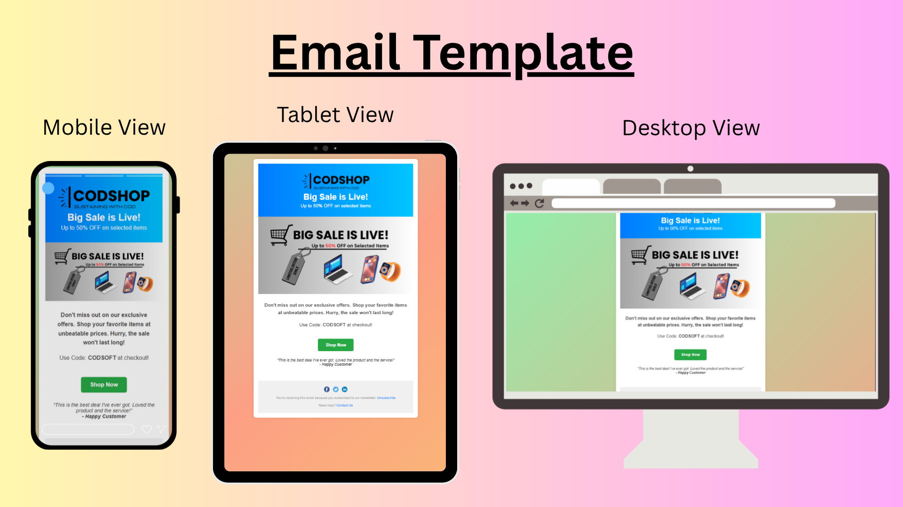

**CodSoft UI/UX Internship**  
# 📩 Task 2 – Email Template Design  
Designed by: *Ishaan*

---

## 📌 Overview

This project is a **responsive promotional email template** created for Task 2 of the CodSoft UI/UX Internship.  
It replicates a real-world marketing email with modern layout, clean branding, and engaging visual elements.

---

## ✨ Features

- ✅ Fully responsive layout for desktop and mobile
- ✅ Animated gradient background using CSS
- ✅ Custom logo and designed promotional banner
- ✅ Highlighted coupon code with urgency
- ✅ Interactive “Shop Now” button with hover effect
- ✅ Social media links in footer
- ✅ Accessible typography and structure

---

## 🧰 Technologies Used

- HTML5
- CSS3
- Google Fonts (Poppins)
- CSS Animations (`@keyframes`)
- No external libraries or frameworks

---

## 📸 Preview

> Here's a screenshot of the final email layout in the browser:



---

## 📂 Folder Structure

```
Task 2 - Email Template/
├── task 2.html
├── README.md
├── BANNER.png
├── CODSHOP logo.png
└── preview.png
```

---

## 🔗 How to Run

- Open `task 2.html` in any browser (Chrome/Edge recommended)
- No setup or dependencies needed

---

## 🙌 Internship Credit

Designed as part of the **UI/UX Internship Program by [CodSoft](https://www.codsoft.in/)**  
**Task:** Design a fully responsive promotional email with animated and branded components.

---

## 📫 Connect with Me

- 📧 Email: *ishaanralhan0@gmail.com*
- 💼 LinkedIn: [linkedin.com/in/Ishaan-](https://www.linkedin.com/in/ishaan-500900351/)
- 🌐 GitHub: [github.com/Ishaan-2589](https://github.com/Ishaan-2589)

---
